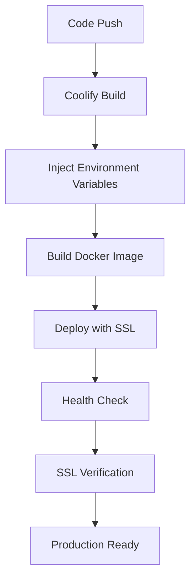

# Design Document: HTTPS Deployment Fix

## Architecture Overview

### Current Architecture Issues
```
Client (HTTPS) → Mixed HTTP Requests → API Servers (HTTP)
     ↓
Mixed Content Errors → Blocked Requests → Failed Fetch Operations
```

### Target Architecture
```
Client (HTTPS) → HTTPS Requests → Load Balancer/SSL Termination → API Servers
     ↓
Secure Communication → Successful API Calls → Functional Application
```

## Technical Implementation Details

### 1. Environment Variable Strategy

#### Problem
Hardcoded HTTP URLs in multiple files create deployment inconsistencies.

#### Solution
Implement a hierarchical environment variable system:

```typescript
// Config hierarchy
1. Production environment variables (HTTPS)
2. Staging environment variables (HTTPS)
3. Development environment variables (HTTP fallback)
4. Default localhost configuration
```

#### Environment Variables Required
```bash
# Primary API configuration
VITE_SUPABASE_URL=https://your-domain.com
SUPABASE_URL=https://your-domain.com
API_EXTERNAL_URL=https://your-domain.com

# Fallback for development
VITE_SUPABASE_URL_DEV=http://localhost:8000
```

### 2. Supabase Client Architecture

#### Current Implementation Issues
- Hardcoded HTTP URLs in client files
- No environment-aware configuration
- Production and development use same URLs

#### Proposed Solution
Environment-aware client configuration:

```typescript
// src/integrations/supabase/config.ts
export const getSupabaseConfig = () => {
  const isProduction = import.meta.env.PROD;
  const baseUrl = isProduction
    ? import.meta.env.VITE_SUPABASE_URL
    : import.meta.env.VITE_SUPABASE_URL_DEV || 'http://localhost:8000';

  return {
    url: baseUrl,
    anonKey: import.meta.env.VITE_SUPABASE_ANON_KEY
  };
};
```

### 3. Nginx HTTPS Configuration

#### SSL/TLS Configuration
```nginx
# Primary HTTPS server block
server {
    listen 443 ssl http2;
    server_name your-domain.com;

    # SSL certificates
    ssl_certificate /etc/ssl/certs/your-cert.pem;
    ssl_certificate_key /etc/ssl/private/your-key.pem;

    # SSL configuration
    ssl_protocols TLSv1.2 TLSv1.3;
    ssl_ciphers ECDHE-RSA-AES256-GCM-SHA512:DHE-RSA-AES256-GCM-SHA512;
    ssl_prefer_server_ciphers off;

    # Security headers
    add_header Strict-Transport-Security "max-age=63072000" always;
    add_header X-Frame-Options "SAMEORIGIN" always;
    add_header X-Content-Type-Options "nosniff" always;
    add_header X-XSS-Protection "1; mode=block" always;
    add_header Referrer-Policy "strict-origin-when-cross-origin" always;

    # Existing configuration...
}

# HTTP to HTTPS redirect
server {
    listen 80;
    server_name your-domain.com;
    return 301 https://$server_name$request_uri;
}
```

### 4. Docker Configuration Strategy

#### Multi-Stage Build Considerations
- Build stage: Environment-aware URL injection
- Production stage: SSL certificate mounting
- Development stage: HTTP fallback support

#### Environment Injection
```dockerfile
# Build-time URL configuration
ARG VITE_SUPABASE_URL
ENV VITE_SUPABASE_URL=${VITE_SUPABASE_URL}
ARG VITE_SUPABASE_ANON_KEY
ENV VITE_SUPABASE_ANON_KEY=${VITE_SUPABASE_ANON_KEY}
```

### 5. Deployment Pipeline Integration

#### Coolify-Specific Considerations
- SSL certificate management through Coolify
- Environment variable injection
- Health check endpoints
- Rollback strategies

#### Deployment Flow


## Security Considerations

### 1. Certificate Management
- Use Let's Encrypt through Coolify or custom certificates
- Implement automatic renewal
- Monitor certificate expiration

### 2. Security Headers
- HSTS (HTTP Strict Transport Security)
- Content Security Policy (CSP)
- X-Frame-Options, X-Content-Type-Options
- Referrer Policy

### 3. API Security
- Ensure all API endpoints use HTTPS
- Validate SSL certificates in development
- Monitor for mixed content warnings

## Performance Optimizations

### 1. HTTP/2 Support
- Enable HTTP/2 in Nginx configuration
- Optimize asset loading with multiplexing

### 2. Caching Strategy
- HTTPS-aware caching headers
- Asset versioning for cache invalidation
- Service worker considerations

## Monitoring and Debugging

### 1. Mixed Content Detection
- Browser console monitoring
- Automated testing for mixed content
- Production monitoring alerts

### 2. SSL Certificate Monitoring
- Certificate expiration alerts
- SSL/TLS configuration validation
- Security scanning integration

## Rollback Strategy

### 1. Immediate Rollback
- Keep previous configuration version
- Quick DNS/Load Balancer reconfiguration
- Database connection preservation

### 2. Gradual Rollback
- Canary deployment approach
- Feature flags for HTTPS enforcement
- A/B testing for SSL configuration

## Testing Strategy

### 1. Local Development
- Self-signed certificates for local testing
- Environment-specific configurations
- Hot reload with HTTPS

### 2. Integration Testing
- SSL certificate validation
- API endpoint accessibility
- Mixed content scanning

### 3. Production Testing
- Staging environment validation
- Blue-green deployment approach
- User acceptance testing

## Implementation Timeline

### Phase 1: Configuration Updates (1-2 days)
- Environment variable updates
- Supabase client modifications
- Basic testing

### Phase 2: Infrastructure Changes (2-3 days)
- Nginx HTTPS configuration
- Docker updates
- SSL certificate setup

### Phase 3: Testing and Deployment (1-2 days)
- Staging environment validation
- Production deployment
- Post-deployment monitoring

Total estimated time: 4-7 days

## Risk Mitigation

### Technical Risks
- Certificate management issues
- Configuration conflicts
- Performance degradation

### Mitigation Strategies
- Thorough testing in staging
- Gradual rollout with monitoring
- Quick rollback procedures
- 24/7 monitoring during initial deployment